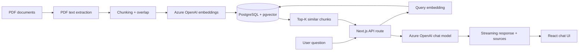

# RAG Chatbot — Document Q&A with Next.js, Azure OpenAI & pgvector

A Retrieval-Augmented Generation (RAG) document Q&A application built with Next.js, Azure OpenAI, PostgreSQL, and pgvector.

The application combines **Next.js 16, React 19, TypeScript, Vercel AI SDK, Azure OpenAI, PostgreSQL, and pgvector**. Documents are parsed into text chunks, converted into embeddings, stored in PostgreSQL, and retrieved with cosine similarity before the LLM generates a streaming answer with source references.

> **Portfolio note:** This project is intentionally scoped as a working prototype. It demonstrates the core RAG pipeline and identifies production hardening areas such as authentication, rate limiting, chat persistence, and re-ranking.
>
> This is a personal project built independently to demonstrate RAG architecture. It does not contain code from any employer.

## Demo

This repository is provided as a source-code portfolio project and does not include a hosted public demo.

The complete application requires:
- Azure OpenAI credentials
- PostgreSQL with pgvector
- Local environment configuration

No API keys or private credentials are included in the repository.

## What it demonstrates

- **RAG pipeline:** PDF ingestion → text extraction → chunking → embeddings → vector search → grounded generation
- **Azure OpenAI integration:** separate embedding and chat deployments
- **Semantic retrieval:** pgvector cosine-similarity search with top-k retrieval
- **Streaming UX:** assistant responses stream to the React UI using the Vercel AI SDK
- **Source attribution:** retrieved document chunks and similarity scores are surfaced with each answer
- **Reusable backend modules:** database, embedding/model configuration, chunking, and shared types are separated from the UI
- **Developer workflow:** Docker Compose for local PostgreSQL/pgvector and scripts for database initialization and document ingestion

## Architecture



## Tech stack

| Layer | Technologies |
| --- | --- |
| Front end | Next.js, React, TypeScript |
| AI | Vercel AI SDK, Azure OpenAI |
| Retrieval | PostgreSQL, pgvector, cosine similarity |
| Document processing | pdf-parse, custom text chunking |
| Infrastructure | Docker Compose |
| Developer tooling | npm, TypeScript, tsx |

## Project structure

```text
app/
  api/chat/route.ts       # RAG retrieval + streaming chat endpoint
  page.tsx                # React chat interface
  layout.tsx              # App metadata/layout
  globals.css             # UI styling
lib/
  azure-openai.ts         # Azure OpenAI model + embedding setup
  db.ts                   # PostgreSQL/pgvector queries
  chunk.ts                # Text chunking with overlap
  types.ts                # Shared RAG message/source types
scripts/
  ingest.ts               # PDF extraction, chunking and embedding pipeline
  init-db.ts              # Applies the database schema

db/init.sql               # pgvector extension, table and indexes
docker-compose.yml        # Local PostgreSQL + pgvector
```

## How the RAG flow works

### 1. Ingestion

`npm run ingest` scans the `documents/` directory for PDFs. Each PDF is parsed into text, divided into overlapping chunks, and sent to the Azure OpenAI embedding deployment in batches. Existing chunks for the same source file are removed before re-ingestion to avoid duplicates.

### 2. Retrieval

When a user submits a question, the API creates an embedding for the query and performs a cosine-similarity search against the `pgvector` index. The top five matching chunks are added to the model context.

### 3. Generation

The Azure OpenAI chat model receives the retrieved context and is instructed to answer only from that context. The response is streamed to the browser, while the retrieved sources are returned as message metadata.

## Getting started

### Prerequisites

- Node.js 20+
- Docker Desktop (or PostgreSQL with the pgvector extension)
- Azure OpenAI resource with:
  - one embedding deployment
  - one chat-model deployment

### 1. Install dependencies

```bash
npm install
cp .env.example .env
```

Configure `.env` with your Azure OpenAI settings and PostgreSQL connection string. **Never commit `.env` or real credentials.**
> **Credentials:** This repository does not include Azure OpenAI API keys, database credentials, or other secrets. To run the complete RAG pipeline, provide your own Azure OpenAI resource and PostgreSQL/pgvector configuration in `.env`.
>
> The author does not provide shared API credentials or a hosted demo. This keeps the repository safe for public use and allows developers to configure their own Azure OpenAI environment.


### 2. Start PostgreSQL + pgvector

```bash
docker compose up -d
```

The included database initialization script creates the `documents` table and vector index on first startup.

If you are using an existing PostgreSQL instance instead:

```bash
npm run db:init
```

### 3. Ingest documents

Place PDF files in `documents/`, then run:

```bash
npm run ingest
```

A sample PDF is included so the ingestion pipeline can be exercised once Azure OpenAI and PostgreSQL/pgvector credentials are configured.

### 4. Start the application

```bash
npm run dev
```

Open `http://localhost:3000` and ask questions about the ingested documents.

## Environment variables

| Variable | Purpose |
| --- | --- |
| `DATABASE_URL` | PostgreSQL connection string |
| `AZURE_OPENAI_RESOURCE_NAME` | Azure OpenAI resource name |
| `AZURE_OPENAI_API_KEY` | Azure OpenAI API key |
| `AZURE_OPENAI_API_VERSION` | Azure OpenAI API version |
| `AZURE_OPENAI_EMBEDDING_DEPLOYMENT` | Embedding deployment name |
| `AZURE_OPENAI_CHAT_DEPLOYMENT` | Chat deployment name |
| `EMBEDDING_DIMENSIONS` | Must match the pgvector column dimensions |

## Engineering decisions

- **Chunk overlap:** preserves context across chunk boundaries during retrieval.
- **Batch embeddings:** reduces the number of embedding calls during ingestion.
- **Cosine similarity:** provides a simple semantic retrieval strategy for the prototype.
- **Source metadata:** makes retrieved context observable to the UI instead of returning an answer without attribution.
- **Node.js runtime:** the API route uses the Node runtime because the PostgreSQL client requires a standard TCP connection.
- **IVFFlat index:** appropriate for the current prototype size; HNSW would be a candidate for a larger production corpus.

## Current limitations / production roadmap

This repository deliberately does **not** implement several production concerns yet:

- Authentication and authorization
- Rate limiting and abuse protection
- Persistent chat history
- Retrieval re-ranking / hybrid search
- OCR for scanned PDFs
- Document-level access control
- Automated evaluation of retrieval and answer quality
- Observability, tracing, and usage/cost monitoring

These are natural next steps if the prototype were evolved into a production service.

## License

This project is provided as a portfolio/demo project.
